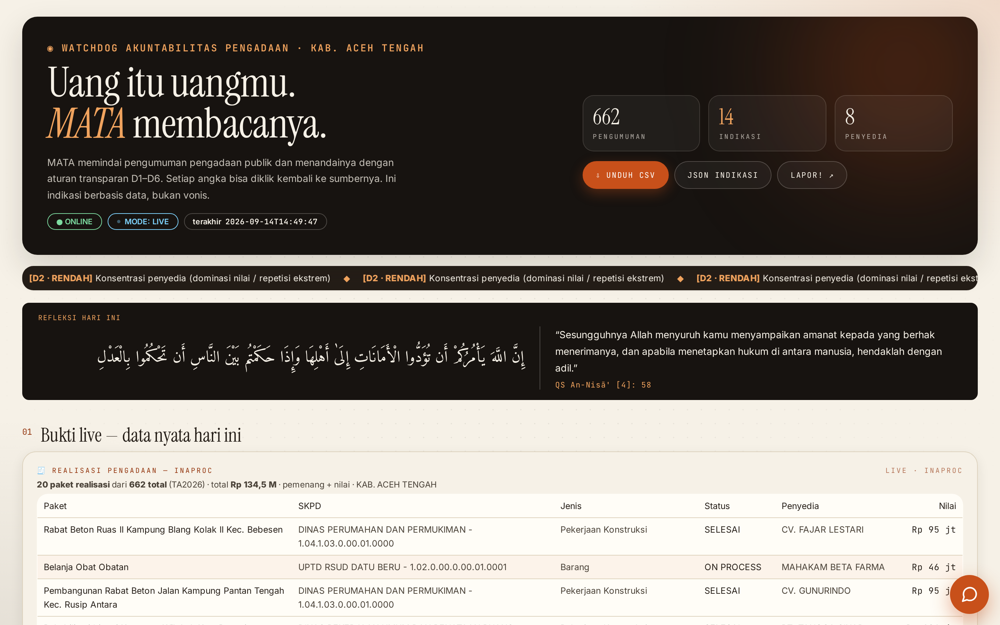
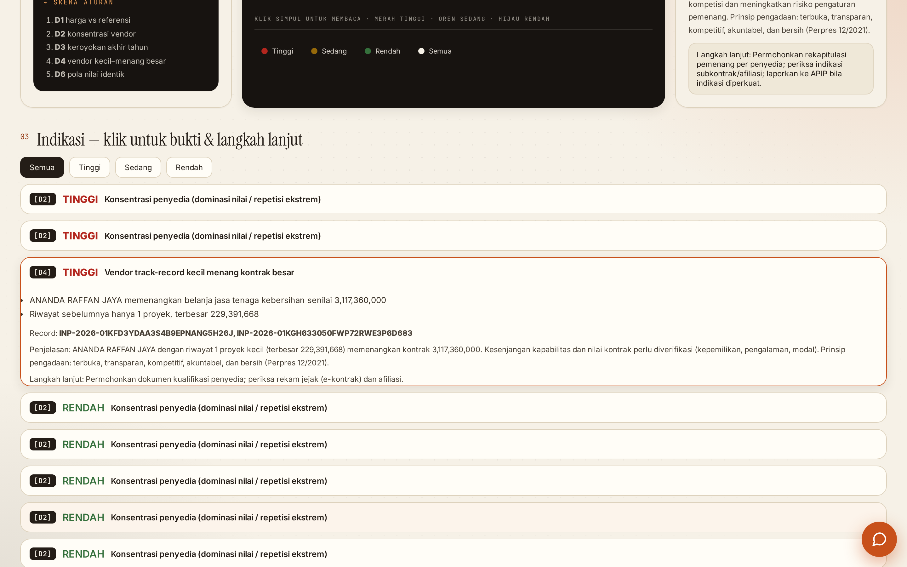
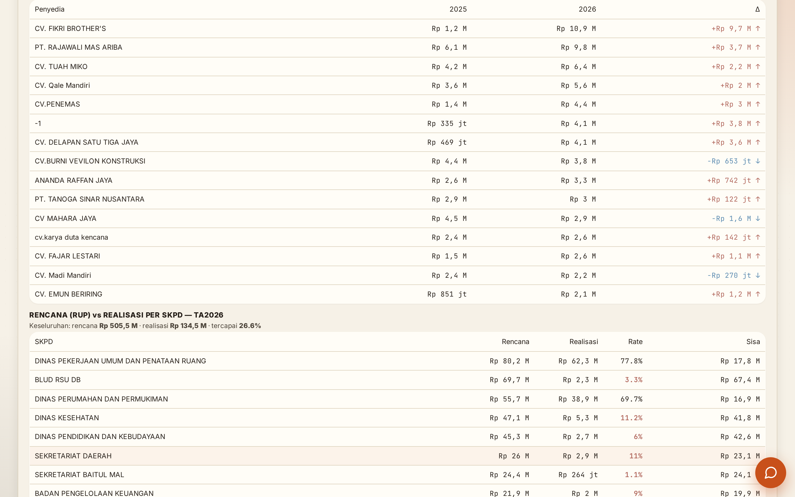
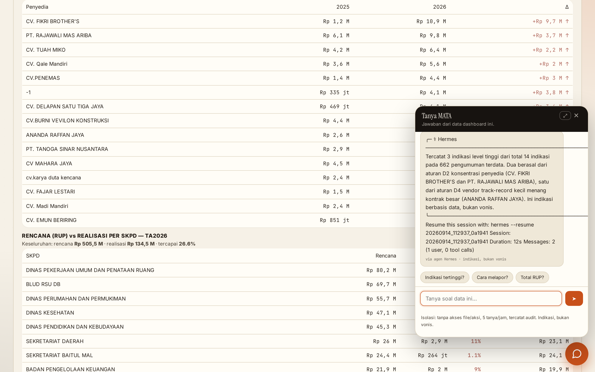

# MATA

### Watchdog Akuntabilitas Pengadaan — Kabupaten Aceh Tengah

> **“Uang itu uangmu. MATA membacanya.”**

|[🟢 DASHBOARD LIVE](https://mata.niumination.web.id) &nbsp;·&nbsp; [▶️ VIDEO DEMO](https://youtu.be/dbw5KVA75q8) &nbsp;·&nbsp; [📰 ARTIKEL](https://www.linkedin.com/pulse/triliunan-rupiah-sudah-dibuka-tidak-ada-yang-membacanya-kali-0v7xc)

**AI HackFest 2026 · Batch 3** — Kategori *Digital Safety & Public Good / AI Agent* — Peserta: **Afrizal Munthe**



---

## Masalah

Data pengadaan publik Kabupaten Aceh Tengah **sudah dibuka** — tapi tidak ada yang membacanya.

| TA2026 (realisasi, sumber: data.inaproc.id) | Nilai |
|---|---:|
| Pengumuman pengadaan | **662** |
| Total nilai | **Rp 134,5 M** |
| Penyedia | **170** |
| Rencana (RUP) vs realisasi | **26,6%** |

Data itu tersedia untuk siapa pun, dalam format yang mustahil dibaca manusia: ribuan baris, kode SKPD, nama paket yang repetitif, tanpa konteks. Sementara konteks nasionalnya jelas:

- **BPKP (2023):** >Rp 141 T ketidakefisienan perencanaan & penganggaran pemda.
- **BPK:** 9.261 temuan senilai Rp 18,19 T hanya pada semester I-2023.
- **KPK (Des 2025):** OTT proyek kereta api Medan — pemenang dikondisikan, HPS bocor.

Kesenjangan antara **data yang terbuka** dan **pengawasan yang berjalan** itu yang MATA tutupi.

## Solusi — agent yang benar-benar bekerja

**MATA adalah AI agent** yang berjalan 24/7 di VPS (framework Hermes, infrastruktur panitia). Setiap siklus ia:

1. **Koleksi** data publik: realisasi pengadaan (`data.inaproc.id`), RUP rencana daerah, riwayat lelang (SPSE LKPP publik) — tanpa login, tanpa proxy, tanpa pihak ketiga.
2. **Analisis** dengan rule engine transparan D1–D6 (deterministik, ambang terdokumentasi — bukan black-box).
3. **Lapor**: dashboard web + CSV/JSON/PDF + indikasi yang **bisa diklik balik ke record ID sumbernya**.
4. **Menjawab**: fitur *Tanya MATA* — agent menjawab pertanyaan juri/publik langsung dari data dashboard (terisolasi: tanpa akses file/eksekusi, 5 tanya/jam, tercatat audit).

**Hasil live saat ini (data terakhir: 14 Sep 2026):**

| Metrik | Nilai |
|---|---:|
| Indikasi terdeteksi | **14** (3 level tinggi) |
| D2 — konsentrasi penyedia | CV. FIKRI BROTHER'S **8,4%** & PT. RAJAWALI MAS ARIBA **7,5%** dari total nilai (ambang 5%) |
| D4 — vendor kecil menang besar | ANANDA RAFFAN JAYA: riwayat terbesar **Rp 229 jt** → menang kontrak **Rp 3,12 M** (±13×) |
| D6 — pola angka identik | 2 pola nilai identik lintas paket |
| Porsi top-10 penyedia | **41,6%** (naik dari 29,3% pada TA2025) |

Setiap angka di atas **bukan vonis** — ia indikasi dengan bukti, record ID, dan langkah lanjut (verifikasi ke APIP / laporkan ke LAPOR!).

### Bukti & indikasi per paket

Kartu indikasi dapat dibuka: bukti, record ID sumber, penjelasan, dan langkah lanjutan.



### Analisis RUP vs realisasi

MATA membandingkan rencana (RUP) dengan realisasi per SKPD — di mana anggaran direncanakan besar tetapi nyaris tidak terserap, di mana lonjakan terjadi.



### Tanya MATA — tanya, jawab dari data

Publik tidak perlu membaca dashboard: cukup bertanya. Jawabannya selalu dari data yang sama — tidak ada klaim di luar data.



## Pendekatan — indikasi, bukan vonis

- **Anti main hakim sendiri.** MATA tidak menghukum siapa pun. Setiap flag = indikasi + bukti + rekomendasi kanal resmi (APIP, Inspektorat, LAPOR!). Nama vendor muncul karena data publik per-paket; konteksnya selalu “perlu diverifikasi”.
- **Rule engine transparan.** Rumus dan ambang D1–D6 dipublikasikan di repo dan dashboard — bisa diaudit, bisa direplikasi.
- **Hibrida jujur.** Deteksi deterministik (bisa diaudit) + AI untuk penjelasan naratif. Yang tidak bisa dideteksi dengan data yang tersedia (D5 *proyek hantu*, D7 *lelang tunggal*) disebut jujur sebagai **roadmap**, bukan diklaim.
- **Identitas lokal.** Dashboard berdesain “living codex” dengan refleksi harian — QS An-Nisa [4]: 58, ayat amanah — relevan untuk wilayah yang mengamanahkan uang rakyat.
- **Privasi pengunjung.** Deteksi lokasi kasar (kota dari IP) hanya dengan izin eksplisit, terhapus otomatis <72 jam (UU PDP No. 27/2022).

## Eksekusi teknis

```
data.inaproc.id ─┐
RUP (perencanaan) ─┼─► KOLEKTOR ─► ANALISIS D1–D6 ─► SQLite + JSON
SPSE LKPP ────────┘        │                │
                           ▼                ▼
                     dashboard web (:80)  laporan CSV/JSON/PDF
                           │
                           ▼
                  Tanya MATA (Hermes, terisolasi)
```

- **Stack:** Python 3 (inti zero-dependency), SQLite, systemd. **Tanpa API berbayar** — semua dari data publik.
- **Reliabilitas:** siklus otomatis terjadwal, endpoint `/health` untuk watchdog, dan **snapshot statis** halaman sebagai jaring pengaman (lihat `snapshot/`).
- **AI hosting (Hermes):** agent otonom — koleksi, analisis, dan tanya-jawab berjalan 24/7 tanpa intervensi manusia; interaksinya tercatat.

| Perintah | Fungsi |
|---|---|
| `python3 run.py cycle` | 1 siklus lengkap: koleksi → analisis → laporan |
| `python3 run.py web` | dashboard (produksi berjalan di :80) |
| `python3 run.py live-test` | uji jalur data langsung |

## Struktur repo

```
mata/                 aplikasi MATA (collector, analyzer, web dashboard, run.py)
screenshots/          bukti produksi (dashboard live)
snapshot/             snapshot statis dashboard — bisa dibuka tanpa server
aihackfest/           dokumentasi hackfest (naskah video, draf artikel & form, cover)
docs/                 blueprint, breakdown, worklog
scripts/              generator snapshot
```

## Legality & etika data

- Sumber: **data publik resmi** (inaproc.id, RUP pemda, SPSE LKPP) — diakses langsung, **tanpa login, tanpa proxy, tanpa bypass**.
- Mematuhi UU ITE, UU PDP, dan ToS platform. Deteksi & pelaporan hanya lewat kanal resmi.
- Nama vendor = data publik per paket; setiap indikasi diberi ruang verifikasi.

## Tautan

- 🟢 Dashboard: <https://mata.niumination.web.id>
- ▶️ Video demo: https://youtu.be/dbw5KVA75q8
- 📰 Artikel: [Triliunan rupiah sudah dibuka, tapi tidak ada yang membacanya](https://www.linkedin.com/pulse/triliunan-rupiah-sudah-dibuka-tapi-tidak-ada-yang-membacanya-kali-0v7xc)
- 📄 Snapshot statis (jaring pengaman): [`snapshot/dashboard-live-2026-09-14-final.html`](snapshot/dashboard-live-2026-09-14-final.html)

---

**MATA** — indikasi berbasis data, bukan vonis. *Uang itu uangmu. MATA membacanya.*
